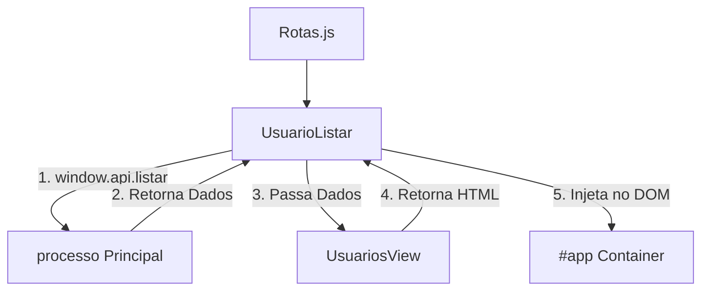

# Padrão de Desenvolvimento para Views (Frontend Read-Only)

Este documento descreve o padrão arquitetural utilizado no frontend do projeto VMS Desktop para a construção de interfaces de consulta. A aplicação foca exclusivamente na exibição de dados.

## 1. Estrutura de Arquivos
Cada módulo (ex: `Usuario`, `Servico`) segue a seguinte estrutura simplificada:
- `NomeModuloView.js`: Centralizador de templates HTML das tabelas.
- `listar/NomeModuloListar.js`: Lógica de consumo de API e injeção de dados.

---

## 2. Componentes do Padrão

### A. NomeModuloView (Template)
Foca exclusivamente na estrutura visual das listagens.
- **Método `renderizarLista(dados)`**: Retorna strings de template contendo a tabela.
- **Método `renderizarMenu()`**: Retorna as opções de navegação do módulo (apenas links para listagem).
- **Badge Helpers**: Métodos como `getBadgeStatus(status)` para formatação visual de dados.

### B. NomeModuloListar (Controller de Interface)
Foca na ponte entre o processo principal e o DOM.
- **Instanciação**: Cria uma instância da View no `constructor`.
- **`renderizarLista()`**: 
    1. Busca dados via `window.api.listarX()`.
    2. Passa os dados para a View gerar o HTML.
    3. Retorna o HTML para o roteador.
- **`adicionarEventos()`**: Reservado para filtros de busca ou paginação (se implementado). Comportamentos de edição e exclusão foram removidos.

---

## 3. Fluxo de Funcionamento

1. **Chamada**: O roteador (`Rotas.js`) chama o método de renderização do `Handler` (ex: `UsuarioListar.renderizarLista()`).
2. **API**: O `Handler` solicita os dados ao processo principal (Main) via IPC.
3. **Template**: O `Handler` passa os dados recebidos para a `View`.
4. **Injeção**: O HTML final é injetado no container principal (`#app`).

---

## 4. Relação de Componentes (Read-Only)

## 5. Boas Práticas (Leitura)
- **Placeholder**: Exibir "Nenhum registro encontrado" caso a lista venha vazia.
- **Formatação**: Utilizar `toLocaleDateString` ou `toFixed(2)` para garantir que dados brutos do banco sejam legíveis.
- **Performance**: Evitar renderizar milhares de linhas de uma vez; se o banco crescer, considerar filtros de período.

